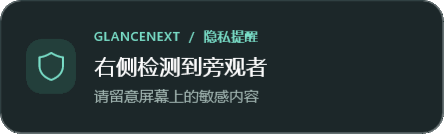

# GlanceNext

[](https://github.com/Dora-z/GlanceNext/actions/workflows/build.yml)
[](LICENSE)

仅使用红外摄像头的 Windows 11 隐私工具。中文 WinUI 3 界面，支持离席锁屏、旁观者提醒及单屏注意力调暗；画面只在本机内存中处理。

这是独立开发的项目，与 Glance by Mirametrix 无隶属关系，不包含其专有代码或 SDK。当前注意力判断使用头部朝向近似估计，不是精确眼球视线追踪。

## 提醒卡片预览

| 浅色 · 左侧提醒 | 深色 · 右侧提醒 |
| --- | --- |
|  |  |

预览使用模拟检测状态，不包含摄像头画面。

## 从源码开始

需要 Windows 11 x64、Git，以及驱动暴露的独立红外数据源；支持 Windows Hello 不代表一定能供此应用独立取流。应用只使用红外摄像头，需先完成设备诊断与校准。

```powershell
git clone https://github.com/Dora-z/GlanceNext.git
cd GlanceNext
.\scripts\setup.ps1
.\scripts\build.ps1 -Publish
.\scripts\run.ps1
```

GitHub Actions 在 Windows runner 上运行规则测试、构建自包含 x64 目录并检查 WinUI 资源。摄像头、Windows 登录恢复及实际 DPI 的验收需在本机执行，详见下文。

## 运行

打开 `dist/GlanceNext/GlanceNext.Desktop.exe`，或运行：

```powershell
.\scripts\run.ps1
```

第一次使用：

1. 进入「设备与校准」，选择独立红外设备，点击「开始诊断」。
2. 确认实时预览正常，等待连续 30 帧有效画面；不支持普通摄像头回退。
3. 在座、离席返回、请第二个人进入画面，观察人数是否正确。分别测试正常光线、弱光和戴眼镜情况。
4. 在正视姿态点击「记录正视」并保持约 3 秒；明显向左或向右转头后点击「记录转头」并保持约 3 秒。
5. 在「确认提醒方向」坐正，点击「确认左右方向」，向你自己的左侧平移头部与上半身，保持一秒。仅转头不算方向确认。结果保存在当前红外设备的设置中。
6. 测试转头与恢复正视、旁观者从左右两侧进入；仅勾选你已确认可靠的功能。勾选不会自动开启功能。
7. 到「隐私保护」开启需要的功能。所有功能、自动遮罩和开机启动默认关闭。

**紧急解除：Ctrl + Alt + G**。它会解除屏幕效果并暂停检测，可在设置中改为另外两个预设组合。快捷键占用时界面会提示，屏幕效果功能不能启用。

关闭窗口进入托盘；双击托盘图标打开，右键暂停、恢复或退出。重复打开应用会唤回已有窗口。用户启用的功能会在下次启动时自动连接红外摄像头，但每次连接仍须重新通过连续有效帧检查。

## 0.1.1 更新

- 锁屏／休眠期间释放摄像头；解锁／唤醒后重新枚举并连接原红外设备。首次连接失败时，按 0.5、1、2、4 秒间隔重试；全部失败后显示具体错误和「重试连接」。重新积累 30 帧有效数据后恢复保护，离席计时从头开始。
- 功能开关与检测状态分开显示。恢复过程保留已有开关和校准；手动暂停、停止、紧急解除或退出会取消恢复，不会在下次解锁时擅自开始检测。
- 旁观者提醒改为浅深主题的青绿色圆角卡片：左侧旁观者在左上角提醒，右侧在右上角提醒，两侧各显示一张。提醒不抢焦点，鼠标可以穿透。
- 先跟踪稳定单人时的主用户位置，再判断其他人相对位置；不会直接选择最大人脸作为主用户。方向变化稳定 0.5 秒后更新。未确认方向、启动时已有多人或匹配不可靠时，使用顶部居中通用提醒。

升级后无需重做原有注意力校准，但需在「设备与校准」完成一次左右方向确认，才能使用左右提醒。

## 构建与依赖

```powershell
.\scripts\setup.ps1
.\scripts\build.ps1 -Publish
```

`setup.ps1` 在项目的 `.tools/dotnet` 安装 .NET SDK 10.0.401，并验证 SDK SHA-512 与模型 SHA-256。不会替换系统 SDK。已有 SDK 10.0.401 时，也可以直接使用 `dotnet` 命令。

```powershell
.\.tools\dotnet\dotnet.exe build .\src\GlanceNext.Desktop\GlanceNext.Desktop.csproj
```

依赖固定为 Windows App SDK 2.5.1、Windows SDK BuildTools 10.0.26100.6584、OpenCvSharp5 5.0.0.20261003 及完整 Windows x64 runtime。`packages.lock.json` 固定传递依赖；构建脚本启用 locked restore。YuNet 模型与许可证随源码和发布目录交付。模型来源及校验值见 `src/GlanceNext.Desktop/Models/README.md`。

发布目录为自包含 x64 桌面应用，不需要另外安装 .NET 或 Windows App Runtime。Windows 11 上仍需正确的摄像头驱动与桌面相机权限。运行时不需要下载模型、访问 Mirametrix 或调用云服务。

## 代码结构

- `src/GlanceNext.Core`：设置、检测结果、注意力／方向校准、位置跟踪、保护规则及检测恢复协调器。
- `src/GlanceNext.Desktop`：WinUI 界面与 ViewModel，红外帧采集、YuNet 检测、Win32 托盘／快捷键／会话事件／屏幕覆盖层。
- `tests/GlanceNext.Tests`：无外部测试依赖的规则测试程序，失败时返回非零退出码。
- `scripts`：环境准备、构建、启动、验证命令。

红外采集只初始化不包含彩色源的独立红外组，读取实际格式，支持 Gray8、Gray16、NV12、YUY2 和 BGRA8 的亮度数据。Gray16 在转换时保留 10／12 位数据的对比度。以约 5 fps 执行本地人脸检测，通过五个关键点与 PnP 近似估计头部朝向。此模型的普通人脸基准不能证明你这颗红外摄像头上的准确率，必须完成设备实测。

离席默认等待 60 秒；第二人持续出现 1 秒后提醒，恢复正常 2 秒后解除；转头持续 3 秒后调暗。调暗与遮罩只控制 Windows 主显示器。动作优先级为锁屏、旁观者遮罩／提醒、注意力调暗。

## 验证

```powershell
.\scripts\verify.ps1 -Mode Rules
.\scripts\verify.ps1 -Mode Ui
.\scripts\verify.ps1 -Mode Hardware
.\scripts\verify.ps1 -Mode Recovery
```

运行 Ui／Hardware 检查前，请从托盘退出已有 GlanceNext 实例。

- Rules：验证离席边界、恢复、防抖、优先级、方向／主用户跟踪、重连退避、重叠会话事件、取消与旧回调隔离；故障／暂停不产生保护动作。
- Ui：不启动摄像头，渲染浅深主题的所有页面、提醒卡片及紧凑布局，并检查提醒焦点和鼠标命中穿透；100%／150%／200% 为截图渲染比例，实际切换 Windows DPI 仍需人工验证。
- Hardware：运行约 12 秒后退出，所有自动动作被强制禁用；仅输出取流与运行状态统计，不保存摄像头画面。
- Recovery：向真实采集流程注入两轮锁屏／解锁事件，实际释放和重开红外设备，确认恢复到 30 帧稳定状态且设置不变；所有自动动作禁用，不会真的锁定 Windows。Windows Hello 占用与实际登录仍须人工验收。

报告和界面截图保存到 `artifacts/verification`。实机验收还应测试：弱光、眼镜、第二人、校准朝向、相机占用／拔出、睡眠唤醒、锁屏解锁、键盘操作及实际 Windows DPI。详情见 `docs/verification.md`。

## 数据与行为边界

设置位于 `%LOCALAPPDATA%/GlanceNext/settings.json`，诊断日志仅记录状态与错误，最多保留当前和上一份约 512 KB 日志。不保存原始帧、人脸截图、关键点日志或身份特征，不上传数据。Ui 测试截图只包含停止摄像头时的界面。

此版本检测画面中是否有人，不识别身份，也不提供活体认证；正常解锁由 Windows 完成。位置跟踪不会保存人脸身份特征，遮挡或重叠时可能只能发出通用提醒。旁观者提醒只表示检测到至少两张人脸，不推断是否正在窥视。摄像头断流、无有效内容或检测异常会解除覆盖层、停止采集并清空计时器，可点击「重试连接」。临时收不到完整帧不会被算作离席。会话锁定／休眠时释放摄像头，恢复后重新验证数据稳定性。

尚未实现多屏视线切换、健康提醒、水印、虚拟演讲和会议静音。

## 开源许可与反馈

GlanceNext 自有源码采用 [MIT 许可证](LICENSE)，第三方模型与依赖见 [THIRD_PARTY_NOTICES.md](THIRD_PARTY_NOTICES.md)。

欢迎通过 [Issues](https://github.com/Dora-z/GlanceNext/issues) 或 Pull Request 提交反馈。设备问题请附 Windows 版本、设备型号、红外格式及脱敏错误说明；请勿提交摄像头画面、个人设置文件或含敏感内容的日志。
